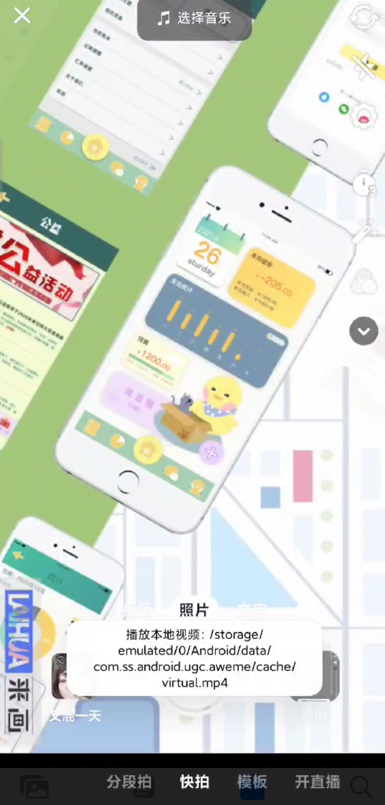

# XVirtualCamera（Xposed虚拟摄像头插件）
[English Version Readme](https://github.com/sandyz987/XVirtualCamera/blob/master/readme_en.md)

A virtual camera module based on the Xposed framework suitable for Android 9.0 and above, written in Kotlin.

适用于Android9.0以上的、基于Xposed框架的**虚拟摄像头**插件。插件由Kotlin编写。

支持替换虚拟摄像头内容为“直播推流 或 视频“，支持的协议有：http、rtsp、rtmp、rtp等。

**使用本开源项目产生的一切后果请自行承担。**

## 插件作用范围

可以将虚拟视频作用在如下地方：

- B站预览、录像
- 抖音预览、录像、直播
- 快手预览、录像、直播[todo：目前新版本存在兼容性问题，容易闪退，待解决]
- 微信视频号预览、录像
- 小米原生相机预览
- WhatsApp视频通话[Sep 18 2024新增]

其他地方插件均不生效（因为未测试，为了兼容性就禁用了），如需使用请修改源代码并重新编译。

## 使用方法

可以以**网络视频**、**视频流**或者**本地视频**作为虚拟摄像头的视频源。

- 1、请手动到Xposed管理器打开插件并且选择作用域APP。
- 2、请在`/storage/emulated/0/Android/data/[你要使用虚拟摄像头的应用包名例如]/cache/stream.txt`中编辑网络视频的地址，注意不要有多的空行。
- 3、当`stream.txt`不存在或内容为空时，使用`/storage/emulated/0/Android/data/[包名]/cache/virtual.mp4`作为虚拟摄像头的视频源。

网络视频支持http、rtsp、rtmp、rtp等流媒体协议，本地视频支持mp4等视频格式。

**使用推流建议解决方案：** OBS直播推流 + Nginx反向代理（具体教程请搜索关键词“利用obs和nginx搭建直播流服务”），
   然后在stream.txt中填写：rtmp://局域网地址:端口号/名称（例如：rtmp://172.20.10.6:1935/live）。延迟大概在2～3秒。

## 免责声明
仅供学习交流使用，或提供一种上传视频的方式。请勿播放其他人的一切视频/作品。**使用本开源项目产生的一切后果请自行承担。**

## 感谢

播放器能支持多种数据源，是因为基于[bilibili/ijkplayer](https://github.com/bilibili/ijkplayer)开发。

## 下载
[Github Release](https://github.com/sandyz987/XVirtualCamera/releases/latest)

## License

This project is licensed under the [GNU General Public Licence 3.0](https://choosealicense.com/licenses/gpl-3.0/).

## 赞助

维护它需要花费我的空余时间，希望你能给予一些赞助~，感激不尽 : )

